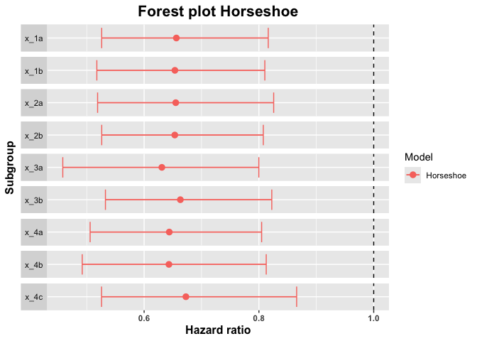

<!-- markdownlint-disable-file -->
<!-- README.md is generated from README.Rmd. Please edit that file -->

# bonsaiforest <a href="https://insightsengineering.github.io/bonsaiforest/latest-tag"></a>

<!-- badges: start -->

[](https://www.repostatus.org/#wip)
[](https://www.r-pkg.org/badges/version-last-release/bonsaiforest)
[](https://cranlogs.r-pkg.org/badges/bonsaiforest)
[](https://cranlogs.r-pkg.org/badges/grand-total/bonsaiforest)
[](https://openpharma.github.io/bonsaiforest/latest-tag/coverage-report/)
<!-- badges: end -->

Subgroup analyses are routinely performed in clinical trial analyses.
This package implements shrinkage methods to estimate treatment effects
in overlapping subgroups with a binary or time-to-event endpoint as
described in [Wolbers et al (2024)](https://arxiv.org/pdf/2407.11729).
Both Bayesian estimation with a regularized horseshoe prior as well as
penalized frequentist methods using the lasso or ridge penalties are
implemented. The Bayesian approach provides both point estimates and
credible intervals whereas only point estimates are available for the
penalized frequentist methods. The estimators are intended to
completement standard subgroup-specific estimators which are routinely
displayed in forest plots. They typically have substantially smaller
overall mean squared error compared to the standard estimator.

## Installation

Please note that on Windows, you will need to install
[`Rtools`](https://cran.r-project.org/bin/windows/Rtools/), because you
will need to have a working `C++` toolchain to compile the Stan models.

### Release

You can install the current release version of `bonsaiforest` from CRAN
with:

``` r
install.packages("bonsaiforest")
```

### Development

You can install the development version of `bonsaiforest` from
[GitHub](https://github.com/) with:

``` r
# install.packages("remotes")
remotes::install_github("insightsengineering/bonsaiforest")
```

## Getting started

See the [introductory
vignette](https://insightsengineering.github.io/bonsaiforest/main/articles/introduction.html)
or get started by trying out the example:

``` r
library(bonsaiforest)
str(example_data)
#> 'data.frame':    1000 obs. of  14 variables:
#>  $ id    : int  1 2 3 4 5 6 7 8 9 10 ...
#>  $ arm   : Factor w/ 2 levels "0","1": 1 1 1 1 2 2 2 2 2 1 ...
#>  $ x_1   : Factor w/ 2 levels "a","b": 2 2 1 1 2 1 1 2 2 1 ...
#>  $ x_2   : Factor w/ 2 levels "a","b": 1 2 1 1 1 2 2 1 2 2 ...
#>  $ x_3   : Factor w/ 2 levels "a","b": 2 1 2 1 2 2 2 1 2 2 ...
#>  $ x_4   : Factor w/ 3 levels "a","b","c": 2 1 3 3 3 3 3 1 3 3 ...
#>  $ x_5   : Factor w/ 4 levels "a","b","c","d": 4 4 1 1 4 1 3 4 4 3 ...
#>  $ x_6   : Factor w/ 2 levels "a","b": 2 1 2 2 2 1 2 2 2 2 ...
#>  $ x_7   : Factor w/ 2 levels "a","b": 2 1 2 2 2 1 1 2 2 2 ...
#>  $ x_8   : Factor w/ 3 levels "a","b","c": 3 2 1 3 3 3 1 1 2 3 ...
#>  $ x_9   : Factor w/ 2 levels "a","b": 2 1 2 2 2 1 1 2 2 2 ...
#>  $ x_10  : Factor w/ 3 levels "a","b","c": 3 3 3 3 3 1 2 2 2 3 ...
#>  $ tt_pfs: num  0.9795 3.4762 1.7947 0.0197 2.2168 ...
#>  $ ev_pfs: num  1 0 1 1 0 0 0 0 0 0 ...

horseshoe_model <- horseshoe(
  resp = "tt_pfs", trt = "arm",
  subgr = c("x_1", "x_2", "x_3", "x_4"),
  covars = c(
    "x_1", "x_2", "x_3", "x_4", "x_5",
    "x_6", "x_7", "x_8", "x_9", "x_10"
  ),
  data = example_data, resptype = "survival",
  status = "ev_pfs", chains = 2, seed = 0,
  control = list(adapt_delta = 0.95)
)
#> Compiling Stan program...
#> Start sampling
#> 
#> SAMPLING FOR MODEL 'anon_model' NOW (CHAIN 1).
#> Chain 1: 
#> Chain 1: Gradient evaluation took 0.000254 seconds
#> Chain 1: 1000 transitions using 10 leapfrog steps per transition would take 2.54 seconds.
#> Chain 1: Adjust your expectations accordingly!
#> Chain 1: 
#> Chain 1: 
#> Chain 1: Iteration:    1 / 2000 [  0%]  (Warmup)
#> Chain 1: Iteration:  200 / 2000 [ 10%]  (Warmup)
#> Chain 1: Iteration:  400 / 2000 [ 20%]  (Warmup)
#> Chain 1: Iteration:  600 / 2000 [ 30%]  (Warmup)
#> Chain 1: Iteration:  800 / 2000 [ 40%]  (Warmup)
#> Chain 1: Iteration: 1000 / 2000 [ 50%]  (Warmup)
#> Chain 1: Iteration: 1001 / 2000 [ 50%]  (Sampling)
#> Chain 1: Iteration: 1200 / 2000 [ 60%]  (Sampling)
#> Chain 1: Iteration: 1400 / 2000 [ 70%]  (Sampling)
#> Chain 1: Iteration: 1600 / 2000 [ 80%]  (Sampling)
#> Chain 1: Iteration: 1800 / 2000 [ 90%]  (Sampling)
#> Chain 1: Iteration: 2000 / 2000 [100%]  (Sampling)
#> Chain 1: 
#> Chain 1:  Elapsed Time: 6.543 seconds (Warm-up)
#> Chain 1:                4.446 seconds (Sampling)
#> Chain 1:                10.989 seconds (Total)
#> Chain 1: 
#> 
#> SAMPLING FOR MODEL 'anon_model' NOW (CHAIN 2).
#> Chain 2: 
#> Chain 2: Gradient evaluation took 7.5e-05 seconds
#> Chain 2: 1000 transitions using 10 leapfrog steps per transition would take 0.75 seconds.
#> Chain 2: Adjust your expectations accordingly!
#> Chain 2: 
#> Chain 2: 
#> Chain 2: Iteration:    1 / 2000 [  0%]  (Warmup)
#> Chain 2: Iteration:  200 / 2000 [ 10%]  (Warmup)
#> Chain 2: Iteration:  400 / 2000 [ 20%]  (Warmup)
#> Chain 2: Iteration:  600 / 2000 [ 30%]  (Warmup)
#> Chain 2: Iteration:  800 / 2000 [ 40%]  (Warmup)
#> Chain 2: Iteration: 1000 / 2000 [ 50%]  (Warmup)
#> Chain 2: Iteration: 1001 / 2000 [ 50%]  (Sampling)
#> Chain 2: Iteration: 1200 / 2000 [ 60%]  (Sampling)
#> Chain 2: Iteration: 1400 / 2000 [ 70%]  (Sampling)
#> Chain 2: Iteration: 1600 / 2000 [ 80%]  (Sampling)
#> Chain 2: Iteration: 1800 / 2000 [ 90%]  (Sampling)
#> Chain 2: Iteration: 2000 / 2000 [100%]  (Sampling)
#> Chain 2: 
#> Chain 2:  Elapsed Time: 6.227 seconds (Warm-up)
#> Chain 2:                8.713 seconds (Sampling)
#> Chain 2:                14.94 seconds (Total)
#> Chain 2:
#> Warning: There were 3 divergent transitions after warmup. See
#> https://mc-stan.org/misc/warnings.html#divergent-transitions-after-warmup
#> to find out why this is a problem and how to eliminate them.
#> Warning: Examine the pairs() plot to diagnose sampling problems

summary_horseshoe <- summary(horseshoe_model, conf = 0.9)
summary_horseshoe
#>   subgroup trt.estimate   trt.low  trt.high
#> 1     x_1a    0.6561374 0.5260189 0.8162805
#> 2     x_1b    0.6535959 0.5176018 0.8102726
#> 3     x_2a    0.6550734 0.5189214 0.8256944
#> 4     x_2b    0.6534071 0.5261231 0.8076542
#> 5     x_3a    0.6308748 0.4582799 0.7998477
#> 6     x_3b    0.6631032 0.5325865 0.8224179
#> 7     x_4a    0.6437881 0.5059100 0.8047302
#> 8     x_4b    0.6431772 0.4921286 0.8127279
#> 9     x_4c    0.6727510 0.5257881 0.8657248

plot(summary_horseshoe)
```


